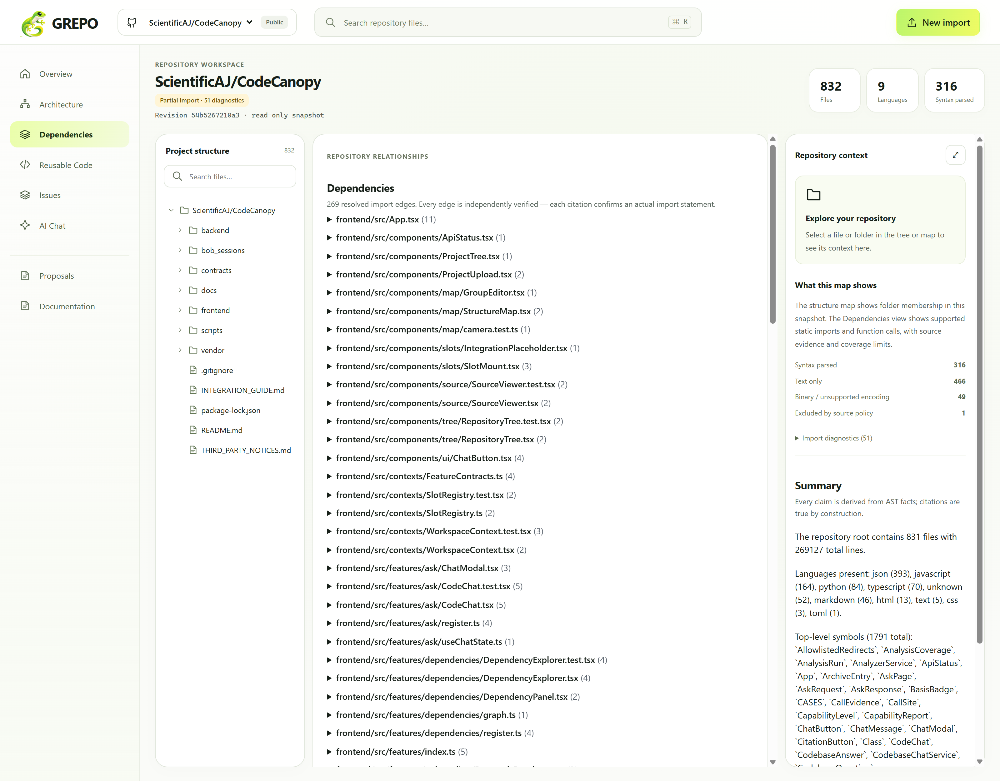
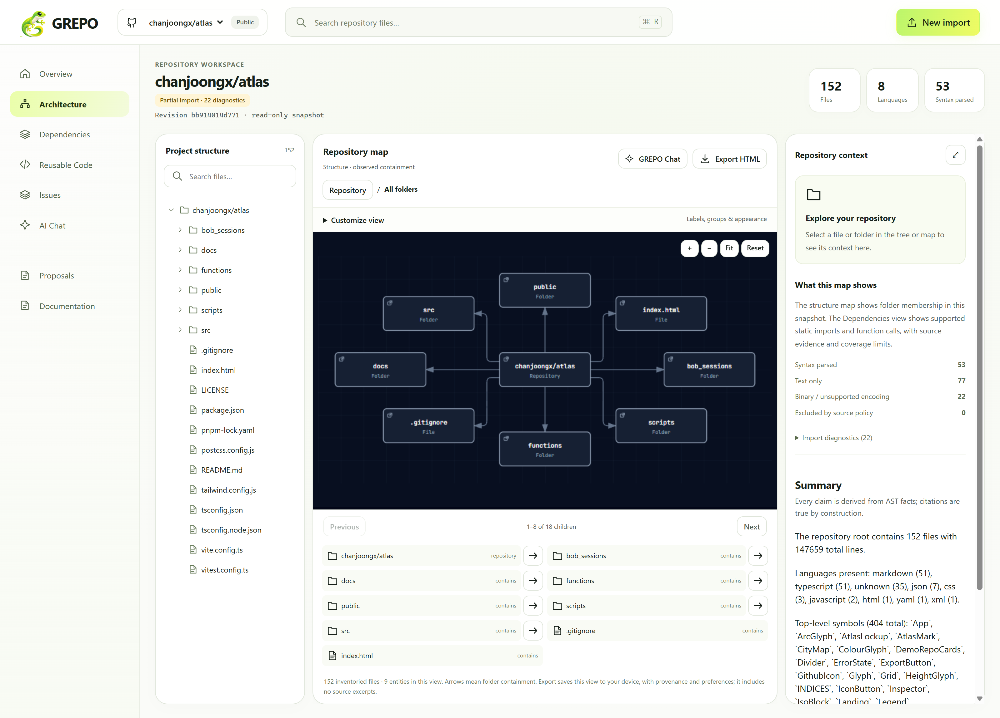
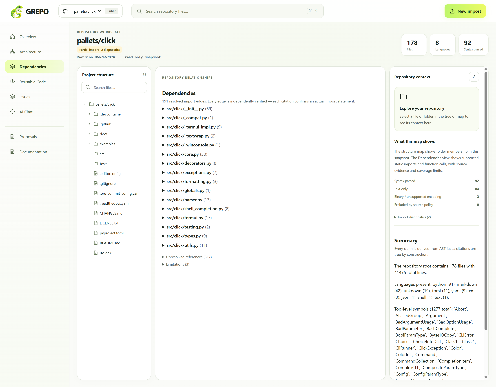
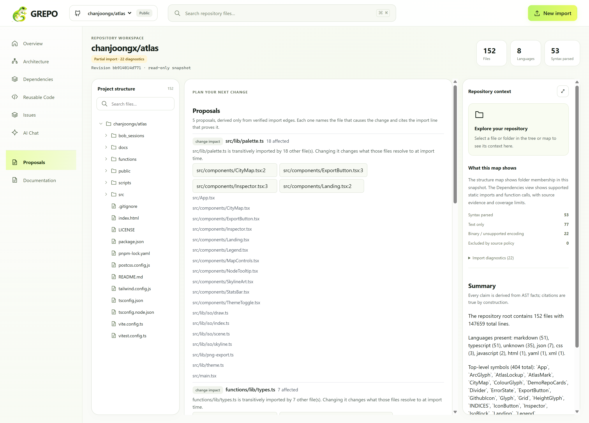
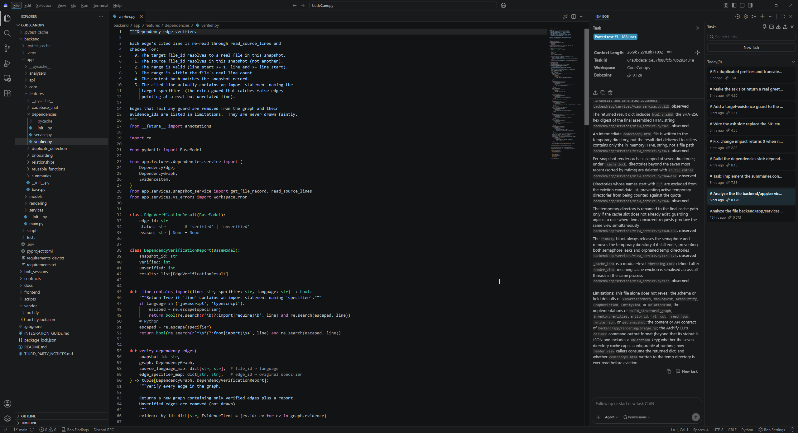

<div align="center">
  
</div>

**Every generated claim is checkable against the source it came from.**

[](docs/images/dependencies-panel.png)

GREPO imports a public GitHub repository or ZIP into a read-only snapshot, then
connects a searchable file tree, an interactive structure map, and bounded
source previews. It summarises files and folders, traces how files and functions
connect, and highlights reusable, duplicated and unused code.

What separates it from the other repository analysers in this category is a
single decision: **GREPO does not ask a model to be correct and hope.** It
computes claims from an AST walk, cites the exact line each one came from, and
then re-reads that line through the snapshot service before showing it to you.
Anything it cannot prove is reported as unproven, with the reason.

## What it looks like

| | |
| --- | --- |
| **Architecture map**, observed containment, drawn from the snapshot, never inferred. | **Verified dependencies**, 269 resolved import edges on this repository's own source, each with the line it came from. |
|  |  |

Every capture above is the live application running against
`ScientificAJ/CodeCanopy`, this repository, at revision `54b5267`.

**Those captures were taken before a status bug was fixed, and they show a
"Partial import" badge that should not have appeared.** The rule was that any
diagnostic at all marked the whole run partial, so the 49 Bob panel PNGs under
`bob_sessions/`, which are binary and carry no syntax to extract, were enough to
label a 832-file repository as degraded. It now imports as `completed`. A run is
only `partial` when something of severity `error` was recorded, which in
practice means the import was interrupted. The two files on this repository that
exceed the parse budget still disclose it individually in the diagnostics list,
and their text stays browsable, but they no longer make the import look broken.

The same view on a well known library. `pallets/click`, 191 verified edges:



## Change proposals

Every slot above answers a question about the repository as it is. Proposals
answers the one that comes next: if you are about to change this file, what else
changes with it?



Each proposal is derived from edges the dependency verifier already accepted,
so a proposal cannot cite an import that would fail verification. A file nothing
imports gets a `review first` entry rather than an invented blast radius, and a
truncated walk is marked with a `+` and the cap stated, so a count is never
presented as exact when it is a lower bound.

## Built with IBM Bob

The verifier, the dependency resolver, the summaries engine and the Ask slot
were written in Bob IDE, task by task, with the briefs and the resulting panels
archived in [`bob_sessions/`](bob_sessions/README.md). Ten sessions, 39.88 of
the 40 Bobcoin budget.



*Bob IDE with `backend/app/features/dependencies/verifier.py` open and the task
panel beside it. This is the guard that rejects an edge whose target does not
exist: the check described below, written by Bob against a brief that
described the attack rather than the fix.*

## Why that matters

Most tools in this space produce a summary and hope it drifted. A summary that
says a function "validates the payload" is worthless if you cannot check it in
one click, and worse than worthless if it is wrong and you have no way to know.

GREPO's summaries and dependency edges carry a line citation for every claim.
Before a claim is displayed, a verifier independently re-reads the cited range
through the snapshot service, which re-checks the content hash, enforces
bounds, and confirms the text at that line actually supports the claim. Claims
that fail are **removed, not shown faintly**.

The same principle runs through the rest of the product. An import that does
not resolve is listed as unresolved with its reason rather than being drawn as
a plausible edge. A change-impact query with no meaningful answer returns an
empty list *and says why* instead of returning a confident zero.

## The verifier, attacked

The claims above are only worth something if they were tested adversarially,
not just demonstrated on a happy-path repository. Six forgery attempts, each
constructed by hand, each run against the real verifier:

| Attack | Result |
| --- | --- |
| Honest graph, real edges | **verified** |
| Citation on a real line that does not import the target | unverified |
| Citation pointing past end of file | unverified |
| `file_id` belonging to a different snapshot | unverified |
| **Citation entirely valid, target file does not exist** | unverified |
| **Null target (external or unresolved)** | unverified |

The last two were found by attacking the finished code, not by writing tests
for it. The first implementation validated the *citation* on every edge but
never checked that the *target* existed, so an edge with a perfect citation
pointing at a fictional file passed. The guard that closes that is now part of
the standard path.

Reproduce the table:

```bash
cd backend
.venv/bin/python scripts/demo_verifier.py
```

## Measured, not estimated

Import cost, measured on real repositories with the harness in
`backend/scripts/stress_test.py`:

| Repository | Files | Import | Dependency analysis |
| --- | --- | --- | --- |
| `ScientificAJ/CodeCanopy` (this repo, also shown above) | 832 | 97s | 269 edges |
| `psf/requests` | 133 | 11.8s | 1.1s, 80 edges, 244 unresolved |
| `pallets/click` | 181 | 27.7s | 2.1s, 191 edges, 517 unresolved |
| `shadcn-ui/ui`, one package | 726 | 125s | 8.4s, 276 edges, 1,633 unresolved |
| `tiangolo/fastapi` | 3,142 | 327.2s | 98.1s, 1,001 edges, 2,553 unresolved |

File counts are what the harness reports after it strips `.git`,
`node_modules`, `dist`, `build`, `coverage`, `.next` and `.turbo`, so they can
be three or four files higher than a raw `find` on the same checkout. The edge
counts are the ones the running application shows, and they match the harness
exactly.

**The boundary is real and stated.** Archives are capped at 10,000 entries,
25 MiB per file, and 250 MiB total uncompressed. `tiangolo/fastapi` is the real
scale test: 3,142 files, 327 seconds to import, then 98 seconds of dependency
analysis to produce 1,001 verified edges. It works, and it takes longer than a
live demo allows. Scope a large repository to one package, or warm the snapshot
with the harness before presenting. This is a deliberate limit on a local,
bounded parser, not a failure.

## How it is built

| Layer | Choice | Why this one |
| --- | --- | --- |
| API | FastAPI + Uvicorn (Python 3.11+) | Async snapshot service; every read goes through one gate that re-checks hashes and bounds |
| Parsing | `tree-sitter` + `tree-sitter-language-pack` | Concrete grammars give real AST nodes. Regex cannot tell an import from a string that looks like one |
| Frontend | React 19 + TypeScript + Vite 6 | Strict types generated from the PRD contracts, so a payload change breaks the build rather than the UI |
| Routing | React Router 7 | Slot-per-feature registry; each feature registers itself and mounts independently |
| Tests | pytest (149) + Vitest (38) + Testing Library | The verifier table is reproducible, not asserted |
| AI (optional) | Groq, server-side only | The one hosted dependency, and only the chat module needs it |

Languages parsed at import: Python, JavaScript, TypeScript/TSX, Java, C#, C, C++,
Go, Rust, Kotlin, Swift, Ruby, PHP and SQL. Anything else is inventoried as
metadata-only and reported as such rather than silently skipped.

## How the code is laid out

```
CodeCanopy/
├── backend/
│   ├── app/
│   │   ├── main.py                     FastAPI entrypoint
│   │   ├── api/
│   │   │   └── v1/
│   │   │       ├── router.py           mounts every v1 route
│   │   │       ├── session.py          browser workspace cookie
│   │   │       ├── imports.py          ZIP + public GitHub, returns a run
│   │   │       ├── snapshots.py        inventory, source, view
│   │   │       ├── findings.py         reuse / duplicates / unused
│   │   │       ├── slots.py            summaries · dependencies · ask · proposals
│   │   │       ├── ask.py              optional Groq call, server-side only
│   │   │       └── dependencies.py     alternate dependency route
│   │   ├── features/                   one package per capability
│   │   │   ├── summaries/              ── summaries.context-panel
│   │   │   ├── dependencies/           ── dependencies.workspace
│   │   │   ├── reusable_functions/     ── reuse.findings
│   │   │   ├── duplicate_detection/    ── (findings route)
│   │   │   ├── codebase_chat/          ── ask.workspace
│   │   │   ├── relationships/
│   │   │   └── onboarding/             ── proposals.detail
│   │   ├── analyzers/
│   │   │   ├── tree_sitter_analyzer.py grammar dispatch, 15 languages
│   │   │   ├── dependency_syntax.py    import and call extraction
│   │   │   ├── python_analyzer.py
│   │   │   ├── java_analyzer.py
│   │   │   ├── js_analyzer.py
│   │   │   └── base.py
│   │   ├── services/
│   │   │   ├── snapshot_service.py     the one gate every read passes
│   │   │   ├── project_archive.py      ZIP validation and limits
│   │   │   ├── inventory_service.py    file and entity inventory
│   │   │   ├── syntax_worker.py       isolated per-file parsing
│   │   │   ├── github_import.py
│   │   │   ├── run_service.py
│   │   │   ├── retention_service.py   24h expiry sweep
│   │   │   ├── view_service.py
│   │   │   └── v1_errors.py           typed WorkspaceError codes
│   │   ├── models/
│   │   ├── rendering/                  pinned Archify compile
│   │   └── core/
│   ├── tests/                          149 passing
│   └── scripts/
│       ├── demo_verifier.py            reproduces the attack table
│       └── stress_test.py              import cost harness
├── frontend/
│   └── src/
│       ├── features/                   mirror of backend/app/features
│       │   ├── summaries/              SummaryPanel.tsx
│       │   ├── dependencies/           DependencyPanel.tsx
│       │   ├── ask/                    CodeChat.tsx
│       │   ├── reusable_functions/     ReusableFunctionPanel.tsx
│       │   ├── duplicate_detection/
│       │   └── onboarding/             ProposalsPanel.tsx
│       ├── components/
│       │   ├── map/                    structure map
│       │   ├── tree/                   searchable file tree
│       │   ├── source/                 bounded source viewer
│       │   ├── slots/                  slot mount + placeholder
│       │   └── ui/                     shared primitives
│       └── contexts/
│           ├── FeatureContracts.ts     slot → generated type
│           ├── SlotRegistry.ts         mount table
│           └── WorkspaceContext.tsx    snapshot identity
├── contracts/
│   ├── prd.schema.json                 the shared payload contract
│   └── structure-1.1.schema.json
├── docs/
│   ├── architecture.md                 pipeline diagram
│   ├── VERIFICATION.md                 dated verification record
│   └── images/                         README captures
└── bob_sessions/                       one numbered folder per Bob task
```

**The two `features/` directories are a mirror, and that is the whole
architecture.** Each capability is one Python package and one React folder
sharing a slot name and a type generated from `contracts/prd.schema.json`:

```
  backend/app/features/summaries/    ←→  frontend/src/features/summaries/
             │                                    │
             └── slot "summaries.context-panel" ──┘
                        registered in both, mounted independently
```

A feature registers itself; it does not edit the workspace layout, the map, the
tree, or the slot registry. That is why six people built six features in
parallel without colliding, and why the dependency panel could be rebuilt
twice, by two people, for two different designs, without touching a shared
file.

## Run locally

Requirements: Linux/macOS, Python 3.11+ and Node.js 22+ with npm. Tested with
Python 3.14 and Node 24. The bounded Python parser uses POSIX resource limits;
on Windows use WSL for this slice. The legacy API remains available separately.

```bash
cd backend
python3 -m venv .venv
.venv/bin/python -m pip install -r requirements-dev.txt
.venv/bin/python -m uvicorn app.main:app --host 127.0.0.1 --port 8000
```

In another terminal:

```bash
cd frontend
npm ci
npm run dev -- --host 127.0.0.1 --port 5173
```

Open **http://127.0.0.1:5173**. Use the same hostname for frontend and backend
(`localhost` also works). The frontend defaults to port 8000 on its own host;
`VITE_API_BASE_URL` can override it. API documentation is at
http://127.0.0.1:8000/docs. These are the two existing development services;
there are no additional feature servers.

**No credentials are required.** Summaries, dependencies, change impact, the
structure map, reuse, duplicate and unused detection all run locally with no
API key and no model provider.

Ask is the one optional module that calls a hosted model. To enable it, put a
Groq API key in `backend/.env` as `GROQ_API_KEY` (free tier, no card). The key
is read server-side only and never reaches the frontend bundle. Without a key
Ask returns an explicit `AI_NOT_CONFIGURED` error rather than a fabricated
answer, and nothing else in the product is affected.

The API needs Node on PATH to run the vendored renderer. Set `CODECANOPY_NODE`
to an absolute Node executable if necessary. No installation inside
`vendor/archify` is needed.

## Explore a repository

1. Enter an HTTPS public GitHub URL, optionally with a branch/tag/commit, or
   upload a ZIP. GitHub refs resolve to a full immutable commit before download.
2. Wait for the import run. It can be cancelled; warnings produce a partial
   result with per-file diagnostics, not fabricated success.
3. Start on the factual overview, then open the architecture map or suggested
   README/manifests. Search the tree (Ctrl/Cmd+K), expand folders, and select a file. Map selection and source inspection share canonical snapshot-scoped IDs.
4. Open **Summaries** and click any citation. The source opens at exactly those
   lines. This is the point of the product.
5. Open **Dependencies**. Resolved edges are grouped by source file, each with a
   citation button. Unresolved references are listed separately with their
   reason: an external package and a missing file are different problems and
   are reported differently.
6. Use Customize view to change labels, order, theme and map density. Create
   virtual groups from the complete inventory, rename/recolor them, and add or
   remove individual members. These preferences never modify source bytes.
7. Export HTML for the current map chapter. The export contains the graph,
   provenance and view preferences, plus Archify's offline interactions. Source
   contents are **not included**. It is a structural view, not an AI report or
   dependency analysis.

Automatic map density shows up to eight children on a wide canvas and three
on a narrow canvas; Customize view also offers explicit density choices.
Sibling paging, folder drilldown, the searchable full tree and the accessible
map list reach the remaining inventory. Browser Back restores focus, page,
selection, source evidence lines and camera; returning via Architecture resumes
the last view in this browser session. Recent imports are available on the
import page, alongside the storage policy and optional GitHub revision selector. No invented architectural
roles or semantic edges are added.

## Storage and bounds

- ZIP: 50 MiB upload, 25 MiB per file, 250 MiB extracted, 10,000 entries.
  Traversal, unsafe Windows names, symlinks, special files and unsupported
  compression are rejected. Generated/dependency directories are skipped.
- GitHub: unauthenticated public HTTPS only. Requests and redirects are checked
  against `github.com`, `api.github.com`, and `codeload.github.com` **before**
  following them. Metadata and archive downloads are bounded. No git hooks or
  repository installation scripts run.
- New workspace data: `CODECANOPY_SNAPSHOTS_DIR`, default
  `<system-temp>/codecanopy/snapshots`. The HttpOnly SameSite=Strict browser
  cookie scopes v1 access. This is a local, single-process workspace model,
  not a multi-user production identity service. Clearing the cookie loses
  access to that workspace.
- Source access expires after 24 hours. Cleanup runs every minute while the API
  is running and at startup; source/render bytes are removed then. Brief
  metadata tombstones and terminal runs are removed after two days. Use
  Snapshot storage → Delete imported repository for immediate deletion.
- Known secret filenames and private-key material are excluded. This is **not
  complete secret detection**; inspect archives before importing sensitive data.
- Valid UTF-8 text of any language is browsable; Python also honors encoding
  declarations. Binary/unsupported encodings have metadata only. Python syntax
  extraction reuses the existing analyzer, isolated to 1 MiB input, 384 MiB
  address space, 2 CPU seconds and a 4-second wall timeout per file. It never
  executes repository code. Other languages are honestly marked text-only.
- Source previews verify the full content hash and return at most 2,000 lines
  and 256 KiB. UI pages use 200 lines. Two imports run concurrently with four
  admitted jobs; processing has a three-minute deadline. Run status is durable;
  interrupted runs report failure after a server restart. Run **one** API worker.
- HTML runs in an opaque sandboxed iframe. A checked source-window, nonce,
  snapshot, view and entity bridge synchronizes selection. Export CSP prohibits
  network connections. No provider keys belong in browser code.

The legacy `/api/projects` API keeps its original storage, contracts and Python
analysis behavior (`CODECANOPY_PROJECTS_DIR`, default system-temp/codecanopy/projects).
Its original routes are not the session-scoped v1 service; keep this development
server on loopback. The v1 UI does not load old legacy uploads or old-name local
workspace sessions automatically.

## Deployment and infrastructure

**There is none checked in, deliberately.** No Dockerfile, no compose file, no
CI workflow, no cloud config. The reason is specific rather than aspirational:

| Property | Why it constrains deployment |
| --- | --- |
| Source expiry | Snapshots live 24 hours, then source bytes are deleted. Nothing persists between sessions. |
| In-process parsing | Syntax extraction runs under POSIX resource limits in the API process. **Run one API worker**, because a second would double-apply `RLIMIT_AS` and `RLIMIT_CPU`. |
| Workspace identity | State is a browser workspace cookie, not an account. Horizontal scaling would need shared session storage. |
| Bounded jobs | Two imports run concurrently, four admitted, three-minute deadline. Capacity planning is four jobs, not unbounded. |

What that means in practice: this runs as a **single-instance local service on
loopback today**, which is how it was developed and how it was recorded. Making
it multi-tenant or publicly hosted is real work: sticky sessions, shared
snapshot storage, a job queue. None of it is pretending to be done.

If you need to run it anywhere but your machine, the sequence is:
1. Containerize both services (the Python one needs the POSIX limits honoured).
2. Move snapshot storage to a shared volume or object store.
3. Replace the workspace cookie with real session storage before scaling out.

`docs/architecture.md` has the pipeline diagram, including the pinned Archify
compile and delivery step.

## APIs and teammate integration

All new behavior is under `/api/v1`:

| Route | Purpose |
| --- | --- |
| `POST /session` | Establish the browser workspace cookie |
| `POST /imports/zip`, `/imports/github` | Return HTTP 202 with a durable run ID |
| `GET /runs/{id}`, `POST /runs/{id}/cancel` | Status, diagnostics and cancellation |
| `GET /projects`, `GET/DELETE /projects/{id}` | Workspace-owned imports |
| `GET /projects/{p}/snapshots` | Available snapshots |
| `GET …/snapshots/{s}` | Immutable revision and expiry |
| `GET …/{s}/files`, `/entities`, `/capabilities` | Inventory and honest coverage |
| `GET …/{s}/source/{file_id}` | Validated bounded line ranges |
| `GET …/{s}/summaries` | Cited summaries with verified evidence |
| `GET …/{s}/dependencies` | Verified import edges, unresolved refs, change impact |
| `GET …/{s}/reuse`, `/duplicates`, `/unused` | Reuse, duplicate and unused findings |
| `GET …/{s}/ask`, `POST …/{s}/chat` | Capability greeting and grounded answers |
| `GET …/{s}/graph` | Bounded observed containment graph |
| `GET/PATCH …/{s}/view` | View-only preferences |
| `POST …/{s}/map` | Validated Archify HTML, graph, hashes and receipt |

Deferred backend endpoints return HTTP **501**, with a machine-readable
`NOT_CONNECTED` response. The UI's unregistered slots make no feature requests.
See [INTEGRATION_GUIDE.md](INTEGRATION_GUIDE.md),
[contract notes](contracts/README.md), [scope](docs/SCOPE.md), and the
[verification record](docs/VERIFICATION.md).

Future work should stay in independent feature packages, reuse these IDs and
source access, and keep provider calls server-side. Preserve the starter's
`backend/app/features` contracts. The registry accepts a component and optional
abortable adapter; its test-only example is not shipped as a feature.

## Verify

```bash
cd backend
.venv/bin/python -m pytest -q
cd ../frontend
npm run contracts
npm run lint
npm run build
npm test
```

For browser checks (the test runner starts both local servers when needed):

```bash
cd frontend
npx playwright install chromium
npm run test:e2e
```

The browser test uses an explicitly synthetic ZIP, exercises real endpoints,
and checks selection, source pagination, organization, deferred pages, responsive
access and offline export. New screenshots and receipts go to
`bob_sessions/local-verification/browser-evidence`. Archived task evidence is
organized in the [BOB session index](bob_sessions/README.md). The container test configuration uses
`--no-sandbox`; normal desktop Chromium can use its own sandbox.

## Archify and licenses

Structure maps use the **complete, unmodified** `archify/` package from
[tt-a1i/archify](https://github.com/tt-a1i/archify/tree/9e35d2b0b39b155553ba9fcfe0b4f2a5198dd993/archify),
pinned to `9e35d2b0b39b155553ba9fcfe0b4f2a5198dd993`.
`vendor/archify.lock.json` records every file hash. GREPO's compiler and
bridge are separate. No fallback diagram renderer is used. See
[THIRD_PARTY_NOTICES.md](THIRD_PARTY_NOTICES.md).

Archify is MIT licensed, copyright tt-a1i and Cocoon AI; its license and bundled
font notices are retained. A license for the project's original application
code has not yet been selected. The supplied gecko image master is preserved
byte-for-byte; CSS viewports show the gecko beside the GREPO wordmark.
