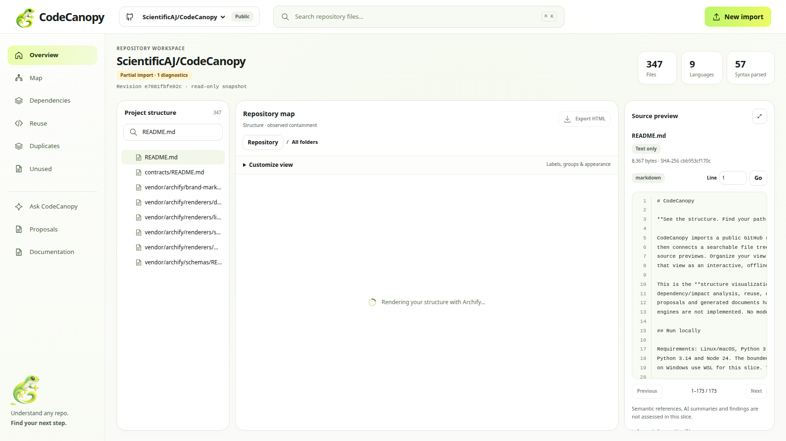

# GREPO

**Every generated claim is checkable against the source it came from.**

GREPO imports a public GitHub repository or ZIP into a read-only snapshot, then
connects a searchable file tree, an interactive structure map, and bounded
source previews. It summarises files and folders, traces how files and functions
connect, and highlights reusable, duplicated and unused code.

What separates it from the other repository analysers in this category is a
single decision: **GREPO does not ask a model to be correct and hope.** It
computes claims from an AST walk, cites the exact line each one came from, and
then re-reads that line through the snapshot service before showing it to you.
Anything it cannot prove is reported as unproven, with the reason.

## Why that matters

Most tools in this space produce a summary and hope it drifted. A summary that
says a function "validates the payload" is worthless if you cannot check it in
one click, and worse than worthless if it is wrong and you have no way to know.

GREPO's summaries and dependency edges carry a line citation for every claim.
Before a claim is displayed, a verifier independently re-reads the cited range
through the snapshot service, which re-checks the content hash, enforces
bounds, and confirms the text at that line actually supports the claim. Claims
that fail are **removed, not shown faintly**.

The same principle runs through the rest of the product. An import that does
not resolve is listed as unresolved with its reason rather than being drawn as
a plausible edge. A change-impact query with no meaningful answer returns an
empty list *and says why* instead of returning a confident zero.

## The verifier, attacked

The claims above are only worth something if they were tested adversarially,
not just demonstrated on a happy-path repository. Six forgery attempts, each
constructed by hand, each run against the real verifier:

| Attack | Result |
| --- | --- |
| Honest graph, real edges | **verified** |
| Citation on a real line that does not import the target | unverified |
| Citation pointing past end of file | unverified |
| `file_id` belonging to a different snapshot | unverified |
| **Citation entirely valid, target file does not exist** | unverified |
| **Null target (external or unresolved)** | unverified |

The last two were found by attacking the finished code, not by writing tests
for it. The first implementation validated the *citation* on every edge but
never checked that the *target* existed, so an edge with a perfect citation
pointing at a fictional file passed. The guard that closes that is now part of
the standard path.

> The 2nd-place repository in the previous edition of this hackathon shipped a
> resolver that "could fabricate targets, so every map drew zero dependency
> arcs." Entirely empty output that looks complete is the failure this design
> is built to make impossible.

Reproduce the table:

```bash
cd backend
.venv/bin/python scripts/demo_verifier.py
```

## Measured, not estimated

Measurements from the local verification run on September 27, 2026:

| Workload | Result |
| --- | --- |
| 120 small Python/TypeScript files, snapshot creation | 21.404s before → 0.150s after; all 120 parsed |
| DeepSeek Harness, extracted source at `477b4f420553` | 13,835 retained files, 5,209 parsed; snapshot creation 45.233s |
| DeepSeek Harness capability report | 0.511s first read, 0.090s repeat |

The DeepSeek parsing measurement excludes network download and ZIP extraction;
the two secret-excluded records in the original 13,837-file inventory are not
copied into its stored source. Network conditions and repository complexity
still affect end-to-end time. Reusable isolated parser workers remove per-file
process startup, use two workers per import, and retain per-file time/memory
limits. The loader shows real file progress, elapsed time, and cancellation.

Archives allow up to 200,000 raw entries and 50,000 retained files after ignored
dependency/build directories. Compressed, per-file and total extracted byte
limits remain enforced. Pre-import a large repository before recording if you
want to start directly in its workspace.

## Run locally

Requirements: Linux/macOS, Python 3.11+ and Node.js 22+ with npm. Tested with
Python 3.14 and Node 24. The bounded Python parser uses POSIX resource limits;
on Windows use WSL for this slice. The legacy API remains available separately.

```bash
cd backend
python3 -m venv .venv
.venv/bin/python -m pip install -r requirements-dev.txt
.venv/bin/python -m uvicorn app.main:app --host 127.0.0.1 --port 8000
```

In another terminal:

```bash
cd frontend
npm ci
npm run dev -- --host 127.0.0.1 --port 5173
```

Open **http://127.0.0.1:5173**. Use the same hostname for frontend and backend
(`localhost` also works). The frontend defaults to port 8000 on its own host;
`VITE_API_BASE_URL` can override it. API documentation is at
http://127.0.0.1:8000/docs. These are the two existing development services;
there are no additional feature servers.

Ask needs a model provider. Set `GROQ_API_KEY` in `backend/.env`; the key is
read server-side only and never reaches the frontend bundle. Every other
feature runs without credentials.

The API needs Node on PATH to run the vendored renderer. Set `CODECANOPY_NODE`
to an absolute Node executable if necessary. No installation inside
`vendor/archify` is needed.

## Explore a repository

1. Enter an HTTPS public GitHub URL, optionally with a branch/tag/commit, or
   upload a ZIP. GitHub refs resolve to a full immutable commit before download.
2. Wait for the import run. It can be cancelled; warnings produce a partial
   result with per-file diagnostics, not fabricated success.
3. Start on the factual overview, then open the architecture map or suggested
   README/manifests. Search the tree (Ctrl/Cmd+K), expand folders, and select a file. Map selection and source inspection share canonical snapshot-scoped IDs.
4. Open **Summaries** and click any citation. The source opens at exactly those
   lines. This is the point of the product.
5. Open **Dependencies**. Resolved edges are grouped by source file, each with a
   citation button. Unresolved references are listed separately with their
   reason — an external package and a missing file are different problems and
   are reported differently.
6. Use Customize view to change labels, order, theme and map density. Create
   virtual groups from the complete inventory, rename/recolor them, and add or
   remove individual members. These preferences never modify source bytes.
7. Export HTML for the current map chapter. The export contains the graph,
   provenance and view preferences, plus Archify's offline interactions. Source
   contents are **not included**. It is a structural view, not an AI report or
   dependency analysis.

Automatic map density shows up to eight children on a wide canvas and three
on a narrow canvas; Customize view also offers explicit density choices.
Sibling paging, folder drilldown, the searchable full tree and the accessible
map list reach the remaining inventory. Browser Back restores focus, page,
selection, source evidence lines and camera; returning via Architecture resumes
the last view in this browser session. Recent imports are available on the
import page, alongside the storage policy and optional GitHub revision selector. No invented architectural
roles or semantic edges are added.



## Storage and bounds

- GitHub: 250 MiB streamed archive download; the extraction limits below still apply.
- ZIP: 50 MiB upload, 25 MiB per file, 250 MiB extracted, 200,000 raw entries
  and 50,000 retained files. Traversal, unsafe Windows names, special files and
  unsupported compression are rejected. Generated/dependency directories are
  skipped. v1 imports skip symbolic links with a visible warning, without
  extracting or following their targets; the legacy API rejects them.
- GitHub: unauthenticated public HTTPS only. Requests and redirects are checked
  against `github.com`, `api.github.com`, and `codeload.github.com` **before**
  following them. Metadata and archive downloads are bounded. No git hooks or
  repository installation scripts run.
- New workspace data: `CODECANOPY_SNAPSHOTS_DIR`, default
  `<system-temp>/codecanopy/snapshots`. The HttpOnly SameSite=Strict browser
  cookie scopes v1 access. This is a local, single-process workspace model,
  not a multi-user production identity service. Clearing the cookie loses
  access to that workspace.
- Source access expires after 24 hours. Cleanup runs every minute while the API
  is running and at startup; source/render bytes are removed then. Brief
  metadata tombstones and terminal runs are removed after two days. Use
  Snapshot storage → Delete imported repository for immediate deletion.
- Known secret filenames and private-key material are excluded. This is **not
  complete secret detection**; inspect archives before importing sensitive data.
- Valid UTF-8 text of any language is browsable; Python also honors encoding
  declarations. Binary/unsupported encodings have metadata only. Syntax extraction
  supports Python, JavaScript/TypeScript, Go, Rust, Java, Kotlin, C/C++, C#, Ruby,
  PHP, Bash and SQL, with 1 MiB input, 384 MiB address space, approximately two
  CPU seconds and a 10-second wall timeout per file. Workers recycle after 128
  files. Repository code never executes; unsupported or failed files remain
  text-only with coverage diagnostics.
- Source previews verify the full content hash and return at most 2,000 lines
  and 256 KiB. UI pages use 200 lines. Two imports run concurrently with four
  admitted jobs; processing has a three-minute deadline. Run status is durable;
  interrupted runs report failure after a server restart. Run **one** API worker.
- Semantic duplicate scoring uses complete function bodies: up to eight pairs,
  12,000 characters per function, and 48,000 characters in total. Larger functions
  retain their structural results and an explicit semantic-coverage limitation.
  Duplicate search bounds (10,000 candidate comparisons and 80 displayed matches)
  are reported rather than presented as exhaustive results.
- AI chat searches complete eligible source files in the selected scope, including
  code beyond the first 3,000 characters. It selects up to ten line-cited passages
  for an 18,000-character model context; a 25-second search budget and oversized
  lines are explicitly reported when they limit coverage. Overview questions
  prioritize top-level documentation. Citations identify real retrieved ranges,
  but do not constitute semantic proof that every model claim is correct.
- HTML runs in an opaque sandboxed iframe. A checked source-window, nonce,
  snapshot, view and entity bridge synchronizes selection. Export CSP prohibits
  network connections. No provider keys belong in browser code.

The legacy `/api/projects` API keeps its original storage, contracts and Python
analysis behavior (`CODECANOPY_PROJECTS_DIR`, default system-temp/codecanopy/projects).
Its original routes are not the session-scoped v1 service; keep this development
server on loopback. The v1 UI does not load old legacy uploads or old-name local
workspace sessions automatically.

## APIs and teammate integration

All new behavior is under `/api/v1`:

| Route | Purpose |
| --- | --- |
| `POST /session` | Establish the browser workspace cookie |
| `POST /imports/zip`, `/imports/github` | Return HTTP 202 with a durable run ID |
| `GET /runs/{id}`, `POST /runs/{id}/cancel` | Status, diagnostics and cancellation |
| `GET /projects`, `GET/DELETE /projects/{id}` | Workspace-owned imports |
| `GET /projects/{p}/snapshots` | Available snapshots |
| `GET …/snapshots/{s}` | Immutable revision and expiry |
| `GET …/{s}/files`, `/entities`, `/capabilities` | Inventory and honest coverage |
| `GET …/{s}/source/{file_id}` | Validated bounded line ranges |
| `GET …/{s}/summaries` | Cited summaries with verified evidence |
| `GET …/{s}/dependencies` | Function/file dependency graph, unresolved refs, change impact |
| `GET …/{s}/dependency-overlay` | Separate verified import overlay contract |
| `GET …/{s}/reuse`, `/duplicates`, `/unused` | Reuse, duplicate and unused findings |
| `GET …/{s}/ask`, `POST …/{s}/chat` | Capability greeting and grounded answers |
| `GET …/{s}/graph` | Bounded observed containment graph |
| `GET/PATCH …/{s}/view` | View-only preferences |
| `POST …/{s}/map` | Validated Archify HTML, graph, hashes and receipt |

Deferred backend endpoints return HTTP **501**, with a machine-readable
`NOT_CONNECTED` response. The UI's unregistered slots make no feature requests.
See [INTEGRATION_GUIDE.md](INTEGRATION_GUIDE.md),
[contract notes](contracts/README.md), [scope](docs/SCOPE.md), and the
[verification record](docs/VERIFICATION.md).

Future work should stay in independent feature packages, reuse these IDs and
source access, and keep provider calls server-side. Preserve the starter's
`backend/app/features` contracts. The registry accepts a component and optional
abortable adapter; its test-only example is not shipped as a feature.

## Verify

```bash
cd backend
.venv/bin/python -m pytest -q
cd ../frontend
npm run contracts
npm run lint
npm run build
npm test
```

For browser checks (the test runner starts both local servers when needed):

```bash
cd frontend
npx playwright install chromium
npm run test:e2e
```

The browser test uses an explicitly synthetic ZIP, exercises real endpoints,
and checks selection, source pagination, organization, deferred pages, responsive
access and offline export. New screenshots and receipts go to
`bob_sessions/local-verification/browser-evidence`. Archived task evidence is
organized in the [BOB session index](bob_sessions/README.md). The container test configuration uses
`--no-sandbox`; normal desktop Chromium can use its own sandbox.

## Archify and licenses

Structure maps use the **complete, unmodified** `archify/` package from
[tt-a1i/archify](https://github.com/tt-a1i/archify/tree/9e35d2b0b39b155553ba9fcfe0b4f2a5198dd993/archify),
pinned to `9e35d2b0b39b155553ba9fcfe0b4f2a5198dd993`.
`vendor/archify.lock.json` records every file hash. GREPO's compiler and
bridge are separate. No fallback diagram renderer is used. See
[THIRD_PARTY_NOTICES.md](THIRD_PARTY_NOTICES.md).

Archify is MIT licensed, copyright tt-a1i and Cocoon AI; its license and bundled
font notices are retained. A license for the project's original application
code has not yet been selected. The supplied gecko image master is preserved
byte-for-byte; CSS viewports show the gecko beside the GREPO wordmark.
