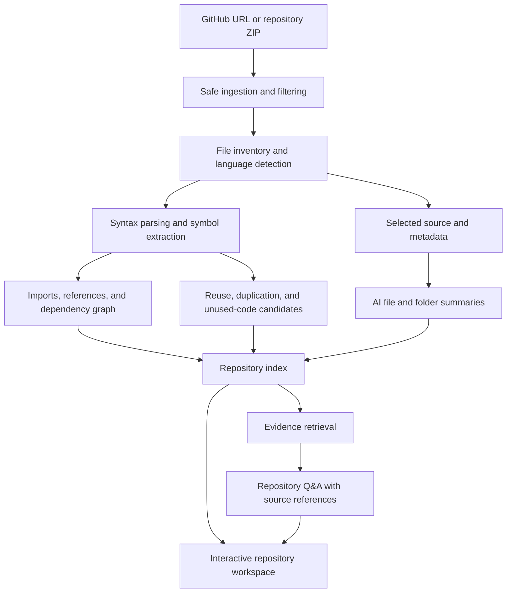

# RepoLens

### See the structure. Understand the code. Find what matters.

**RepoLens** is a proposed AI-powered repository explorer that turns a GitHub repository into an understandable map of its files, folders, dependencies, and functions. Instead of opening dozens of files to work out how a project fits together, developers can explore its structure, read contextual summaries, and ask questions grounded in the code.

> **Project idea for IBM BOB · Status: planning / pre-MVP**  
> This repository currently contains the project brief and roadmap, not a working application. All application features described below are planned. Technology choices and any IBM BOB integration are still to be decided.

---

## The idea

Connect a GitHub repository or upload an exported repository archive. RepoLens analyzes the project and presents an interactive workspace explaining what each part does, how the parts relate, and where improvements may be worth investigating.

The goal is to help developers answer three questions:

- **What is here?** Understand the project layout and the responsibilities of individual files and folders.
- **How does it work together?** Follow dependencies, shared utilities, and relationships between functions.
- **What should I look at next?** Find reusable code, investigate possible duplication, and review potentially unused functions.

## Planned features

| Feature | What it will do |
| --- | --- |
| **Project structure explorer** | Visualize the repository as an expandable file tree and a connected architecture view. Group files by folder, feature, or responsibility without changing the original repository. |
| **AI-generated file and folder summaries** | Explain the purpose of each supported source file and directory, including important functions, exports, and connections to surrounding code. Show unsupported or skipped files explicitly. |
| **Dependency visualization** | Show internal imports and module relationships, alongside external packages declared in supported manifests. Separate confirmed connections from relationships that could not be resolved. |
| **Reusable and shared-function discovery** | Highlight exported functions, shared utilities, and broadly referenced helpers. Show where they are defined and used, and suggest reuse opportunities without assuming they are safe to move. |
| **Potential duplicate detection** | Surface identical or structurally similar functions for comparison, with source locations and an explanation of the match. |
| **Potentially unused-function detection** | Flag functions for which no references were found within the analyzed scope. Treat findings as review candidates, not proof that code can be deleted. |
| **Ask questions about the repository** | Answer natural-language questions using relevant code and summaries, with file paths and line references where available. |

### Organizing a project does not mean silently rewriting it

The initial product will organize the **view of the repository**: searchable groups, tags, maps, and navigation. Moving files, changing imports, merging functions, or deleting code is outside the initial MVP. Any future refactoring workflow should require a preview and explicit approval.

## Example questions

- “What does this project do, and where should I start reading?”
- “Where is authentication implemented?”
- “Which files depend on this module?”
- “Is there already a helper for validating email addresses?”
- “What is the difference between these two similar functions?”
- “Why was this function flagged as potentially unused?”
- “Which parts of the project would be affected by changing this utility?”

Answers should distinguish facts found in the repository from inferences and report when the evidence is insufficient.

## Planned user journey

1. **Import a repository.** Start with a public GitHub URL or a ZIP archive. Add authorized private-repository access in a later phase.
2. **Choose the analysis scope.** Select a branch or revision where supported, review exclusions, and confirm which files may be sent to an AI provider.
3. **Build the project map.** Inventory files, identify supported languages, extract symbols, and resolve imports and references where possible.
4. **Explore the workspace.** Navigate folders, select files, read summaries, and inspect dependency relationships.
5. **Review findings.** Compare reuse opportunities, possible duplicates, and potentially unused functions against the source.
6. **Ask questions.** Retrieve relevant evidence and generate an answer linked to the analyzed repository snapshot.

## Proposed architecture



### Analysis approach

**Static analysis first.** Use language-aware parsing for supported languages to collect files, symbols, exports, imports, and references. Keep observed facts separate from AI-generated explanations.

**Contextual summaries.** Generate file summaries from source and extracted metadata, then produce folder summaries from the responsibilities of their contents. Record the analyzed commit or archive identifier so results can be tied to a specific snapshot.

**Evidence-backed findings.** Each reuse, duplication, or unused-code candidate should include its location, supporting evidence, scope, and limitations. Prefer “no references found in the analyzed files” over “safe to delete.”

**Grounded Q&A.** Retrieve relevant source passages and analysis results before generating an answer. Cite source locations, distinguish inference from observation, and acknowledge incomplete coverage.

**Provider-neutral AI layer.** Keep model access behind an adapter so the team can choose the provider and explore an IBM BOB-related workflow without implying an integration already exists.

## MVP scope

The proposed first version will focus on JavaScript and TypeScript repositories. Other languages can appear in the file inventory, but language-specific analysis must clearly indicate when a language is unsupported.

- [ ] Import a public GitHub repository or ZIP archive with size and file-count limits.
- [ ] Build a navigable file and folder explorer.
- [ ] Extract supported symbols, exports, and import relationships.
- [ ] Generate source-grounded summaries for supported files and folders.
- [ ] Display an internal dependency graph and declared external dependencies.
- [ ] Highlight shared or reusable functions with their observed references.
- [ ] Surface basic exact or structural duplicate candidates.
- [ ] Flag potentially unused functions with explicit scope and limitations.
- [ ] Answer repository questions with source references.
- [ ] Provide progress, failure, skipped-file, and partial-analysis states.

### Suggested demo

Import a small sample repository containing a shared utility, two similar functions, and a function with no obvious references. Show the structure, open a file summary, follow a dependency, compare the flagged functions, and ask where a specific behavior is implemented.

## Future directions

Potential extensions include private-repository authorization, more programming languages, commit-to-commit analysis, incremental re-indexing, shareable reports, team annotations, and explicitly approved refactoring suggestions.

## Proposed implementation layout

The following is a **suggested future layout**, not a list of files that already exist:

```text
repolens/
├── apps/
│   ├── web/                  # Repository explorer, graph, findings, and chat UI
│   └── api/                  # Import, analysis, and query endpoints
├── packages/
│   ├── analyzer/             # Language parsing and static-analysis passes
│   ├── ai/                   # Summary generation and model-provider adapters
│   └── shared/               # Shared types and analysis result schemas
├── fixtures/                 # Sample repositories for evaluation
├── tests/                    # Ingestion, analysis, and Q&A checks
├── docs/                     # Architecture decisions and implementation notes
└── README.md
```

## Safety and privacy requirements

These are design requirements for implementation, not claims about protections already built:

- Analyze repositories as data; do not execute uploaded code, install its dependencies, or run its scripts during ingestion.
- Enforce archive size, extracted size, path, symlink, and file-count checks before processing uploads.
- Exclude secrets, environment files, private keys, generated artifacts, binaries, and dependency directories by default. Treat filtering as a precaution rather than a guarantee that no secrets remain.
- Make AI-provider data sharing explicit. Send only the selected, necessary source content and keep authorization tokens out of prompts and logs.
- Treat instructions inside source files and documentation as untrusted repository content, not commands for the analysis system.
- Limit analysis and findings to the selected repository snapshot. State when dynamic behavior, generated code, external callers, or unsupported syntax could affect conclusions.
- Provide deletion controls and a documented retention policy before accepting private code.
- Never automatically delete or merge functions based on a generated finding.

## How we will evaluate the MVP

Use small, inspectable fixtures with known expected results. Check that summaries match the code, import edges resolve correctly, and findings point to the right locations. Include counterexamples such as exported library functions, callbacks, dynamically selected handlers, and intentional duplicates.

Track correctness and false positives separately. Validate that answers actually support their cited sources and that unsupported questions produce an honest limitation rather than a confident guess.

## Getting started

There is no runnable app or installation command yet. Start by agreeing on the MVP, choosing the implementation stack, and adding a sample repository with expected analysis results. Build the ingestion and parser pipeline before connecting generated summaries and chat.

## Contributing

Early contributions can focus on interface sketches, architecture decisions, sample repositories, parser experiments, analysis rules, and evaluation cases. For a proposed analysis feature, include the source example, expected finding, and at least one case where it should **not** produce a finding.

## License

A project license has not been selected yet.

---

**RepoLens — understand the repository before you change it.**
