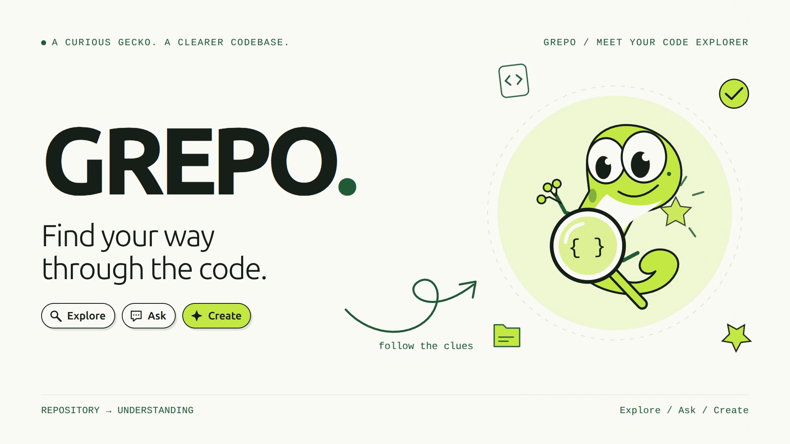

<div align="center">
  
</div>

**Explore repository structure with source evidence in view.**

[](docs/images/dependencies-panel.png)

GREPO imports a public GitHub repository or ZIP into a read-only snapshot, then
connects a searchable file tree, an interactive structure map, and bounded
source previews. It summarises files and folders, traces how files and functions
connect, and highlights reusable, duplicated and unused code.

Deterministic summaries and dependency edges use parsed source facts with
checked line references. AI chat, proposal drafts and generated documentation
use retrieved source excerpts and expose their citations and coverage limits;
review those drafts against the source before relying on them.

**[Open the live demo](https://grepo-two.vercel.app)** · [Hosted setup and limits](docs/deployment/VERCEL.md)

## Watch the demo

A two-minute recorded walkthrough of importing an IBM repository, exploring its
structure and source, tracing dependencies, and creating cited AI answers,
proposals, and documentation.

[](https://github.com/ScientificAJ/Grepo/releases/download/demo-video-v2/GREPO-Demo-v2.mp4)

**V2** keeps the full application in frame, with animated arrows, marker highlights,
emoji reactions, two local magnifiers, and a playful gecko opening and closing.

| Version | Video | Release and credits |
| --- | --- | --- |
| **v2** | [Download v2](https://github.com/ScientificAJ/Grepo/releases/download/demo-video-v2/GREPO-Demo-v2.mp4) | [v2 release](https://github.com/ScientificAJ/Grepo/releases/tag/demo-video-v2) · [Music attribution](docs/demo/Credits-and-publishing-v2.txt) |
| **v1 — original** | [Download v1](https://github.com/ScientificAJ/Grepo/releases/download/demo-video-v1/GREPO-Demo.mp4) | [v1 release](https://github.com/ScientificAJ/Grepo/releases/tag/demo-video-v1) · [Music attribution](docs/demo/Credits-and-publishing.txt) |

Both versions are **1:58 · 1080p · Background music, no narration**.
V1 remains available unchanged. The footage shows the local demo workspace on
September 27, 2026; pauses and unsuccessful retries are edited out.

The [current pitch presentation](docs/demo/GREPO-Presentation-v3.pdf) retains the original 17-slide format, with Hero credited alongside the other contributors on the IBM Bob slide. The [full original evidence](bob_sessions/09-hero-template-audit-reusable-functions/session-summary.md) follows the same task archive naming convention.

## What it looks like

| | |
| --- | --- |
| **Architecture map**, observed containment, drawn from the snapshot, never inferred. | **Verified dependencies**, 269 resolved import edges on this repository's own source, each with the line it came from. |
|  |  |

Every capture above is the live application running against
`ScientificAJ/CodeCanopy`, this repository, at revision `54b5267`.

**Those captures were taken before a status bug was fixed, and they show a
"Partial import" badge that should not have appeared.** The rule was that any
diagnostic at all marked the whole run partial, so the 49 Bob panel PNGs under
`bob_sessions/`, which are binary and carry no syntax to extract, were enough to
label a 832-file repository as degraded. It now imports as `completed`. A run is
only `partial` when something of severity `error` was recorded, which in
practice means the import was interrupted. The two files on this repository that
exceed the parse budget still disclose it individually in the diagnostics list,
and their text stays browsable, but they no longer make the import look broken.

The same view on a well known library. `pallets/click`, 191 verified edges:


## Change proposals

Every slot above answers a question about the repository as it is. Proposals
answers the one that comes next: if you are about to change this file, what else
changes with it?


The **AI-assisted plan** view creates editable, cited drafts for a goal you
supply. **Source-derived suggestions** preserves the deterministic change-impact
view shown above and requires no AI key.

Each source-derived suggestion uses edges the dependency verifier already accepted,
so a proposal cannot cite an import that would fail verification. A file nothing
imports gets a `review first` entry rather than an invented blast radius, and a
truncated walk is marked with a `+` and the cap stated, so a count is never
presented as exact when it is a lower bound.

## Built with IBM Bob

The verifier, the dependency resolver, the summaries engine and the Ask slot
were written in Bob IDE, task by task, with the briefs and the resulting panels
archived in [`bob_sessions/`](bob_sessions/README.md). The evidence covers
Arjun’s repository foundation, Jae’s analysis and targeted fixes, and Sajid’s
chat implementation. Subsequent integration, QA and demo work also used Codex
and manual review; the archive is not a team-wide billing statement.


*Bob IDE with `backend/app/features/dependencies/verifier.py` open and the task
panel beside it. This is the guard that rejects an edge whose target does not
exist: the check described below, written by Bob against a brief that
described the attack rather than the fix.*

## Why that matters

Most tools in this space produce a summary and hope it drifted. A summary that
says a function "validates the payload" is worthless if you cannot check it in
one click, and worse than worthless if it is wrong and you have no way to know.

GREPO's summaries and dependency edges carry a line citation for every claim.
Before a claim is displayed, a verifier independently re-reads the cited range
through the snapshot service, which re-checks the content hash, enforces
bounds, and confirms the text at that line actually supports the claim. Claims
that fail are **removed, not shown faintly**.

The same principle runs through the rest of the product. An import that does
not resolve is listed as unresolved with its reason rather than being drawn as
a plausible edge. A change-impact query with no meaningful answer returns an
empty list *and says why* instead of returning a confident zero.

## The verifier, attacked

The claims above are only worth something if they were tested adversarially,
not just demonstrated on a happy-path repository. One honest control and five forgery attempts, each
constructed by hand and run against the real verifier:

| Attack | Result |
| --- | --- |
| Honest graph, real edges | **verified** |
| Citation on a real line that does not import the target | unverified |
| Citation pointing past end of file | unverified |
| `file_id` belonging to a different snapshot | unverified |
| **Citation entirely valid, target file does not exist** | unverified |
| **Null target (external or unresolved)** | unverified |

The last two were found by attacking the finished code, not by writing tests
for it. The first implementation validated the *citation* on every edge but
never checked that the *target* existed, so an edge with a perfect citation
pointing at a fictional file passed. The guard that closes that is now part of
the standard path.

Reproduce the table:

```bash
cd backend
.venv/bin/python scripts/demo_verifier.py
```

## Measured, not estimated

Measurements from the local verification run on September 27, 2026:

| Workload | Result |
| --- | --- |
| 120 small Python/TypeScript files, snapshot creation | 21.404s before → 0.150s after; all 120 parsed |
| DeepSeek Harness, extracted source at `477b4f420553` | 13,835 retained files, 5,209 parsed; snapshot creation 45.233s |
| DeepSeek Harness capability report | 0.511s first read, 0.090s repeat |

The DeepSeek parsing measurement excludes network download and ZIP extraction;
the two secret-excluded records in the original 13,837-file inventory are not
copied into its stored source. Network conditions and repository complexity
still affect end-to-end time. Reusable isolated parser workers remove per-file
process startup, use two workers per import, and retain per-file time/memory
limits. The loader shows real file progress, elapsed time, and cancellation.

Archives allow up to 200,000 raw entries and 50,000 retained files after ignored
dependency/build directories. Compressed, per-file and total extracted byte
limits remain enforced. Pre-import a large repository before recording if you
want to start directly in its workspace.

Earlier baseline measurements, before the reusable parser-worker optimization,
remain below for comparison; they are not current latency guarantees.

| Repository | Files | Import | Dependency analysis |
| --- | --- | --- | --- |
| `ScientificAJ/CodeCanopy` (this repo, also shown above) | 832 | 97s | 269 edges |
| `psf/requests` | 133 | 11.8s | 1.1s, 80 edges, 244 unresolved |
| `pallets/click` | 181 | 27.7s | 2.1s, 191 edges, 517 unresolved |
| `shadcn-ui/ui`, one package | 726 | 125s | 8.4s, 276 edges, 1,633 unresolved |
| `tiangolo/fastapi` | 3,142 | 327.2s | 98.1s, 1,001 edges, 2,553 unresolved |

File counts are what the harness reports after it strips `.git`,
`node_modules`, `dist`, `build`, `coverage`, `.next` and `.turbo`, so they can
be three or four files higher than a raw `find` on the same checkout. The edge
counts are the ones the running application shows, and they match the harness
exactly.

## How it is built

| Layer | Choice | Why this one |
| --- | --- | --- |
| API | FastAPI + Uvicorn (Python 3.11+) | Async snapshot service; every read goes through one gate that re-checks hashes and bounds |
| Parsing | `tree-sitter` + `tree-sitter-language-pack` | Concrete grammars give real AST nodes. Regex cannot tell an import from a string that looks like one |
| Frontend | React 19 + TypeScript + Vite 6 | Strict types generated from the PRD contracts, so a payload change breaks the build rather than the UI |
| Routing | React Router 7 | Slot-per-feature registry; each feature registers itself and mounts independently |
| Tests | pytest + Vitest + Testing Library | The verifier table is reproducible, not asserted |
| AI (optional) | Groq, server-side only | Chat, AI-assisted proposals and generated documentation; deterministic analysis works without it |

Languages parsed at import: Python, JavaScript, TypeScript/TSX, Java, C#, C, C++,
Go, Rust, Kotlin, Swift, Ruby, PHP and SQL. Anything else is inventoried as
metadata-only and reported as such rather than silently skipped.

## How the code is laid out

```
CodeCanopy/
├── backend/
│   ├── app/
│   │   ├── main.py                     FastAPI entrypoint
│   │   ├── api/
│   │   │   └── v1/
│   │   │       ├── router.py           mounts every v1 route
│   │   │       ├── session.py          browser workspace cookie
│   │   │       ├── imports.py          ZIP + public GitHub, returns a run
│   │   │       ├── snapshots.py        inventory, source, view
│   │   │       ├── findings.py         reuse / duplicates / unused
│   │   │       ├── slots.py            summaries · dependencies · ask · proposals
│   │   │       ├── ask.py              optional Groq call, server-side only
│   │   │       └── dependencies.py     alternate dependency route
│   │   ├── features/                   one package per capability
│   │   │   ├── summaries/              ── summaries.context-panel
│   │   │   ├── dependencies/           ── dependencies.workspace
│   │   │   ├── reusable_functions/     ── reuse.findings
│   │   │   ├── duplicate_detection/    ── (findings route)
│   │   │   ├── codebase_chat/          ── ask.workspace
│   │   │   ├── relationships/
│   │   │   └── onboarding/             ── proposals.derived
│   │   ├── analyzers/
│   │   │   ├── tree_sitter_analyzer.py grammar dispatch, 15 languages
│   │   │   ├── dependency_syntax.py    import and call extraction
│   │   │   ├── python_analyzer.py
│   │   │   ├── java_analyzer.py
│   │   │   ├── js_analyzer.py
│   │   │   └── base.py
│   │   ├── services/
│   │   │   ├── snapshot_service.py     the one gate every read passes
│   │   │   ├── project_archive.py      ZIP validation and limits
│   │   │   ├── inventory_service.py    file and entity inventory
│   │   │   ├── syntax_worker.py       isolated per-file parsing
│   │   │   ├── github_import.py
│   │   │   ├── run_service.py
│   │   │   ├── retention_service.py   24h expiry sweep
│   │   │   ├── view_service.py
│   │   │   └── v1_errors.py           typed WorkspaceError codes
│   │   ├── models/
│   │   ├── rendering/                  pinned Archify compile
│   │   └── core/
│   ├── tests/                          backend regression checks
│   └── scripts/
│       ├── demo_verifier.py            reproduces the attack table
│       └── stress_test.py              import cost harness
├── frontend/
│   └── src/
│       ├── features/                   mirror of backend/app/features
│       │   ├── summaries/              SummaryPanel.tsx
│       │   ├── dependencies/           DependencyPanel.tsx
│       │   ├── ask/                    CodeChat.tsx
│       │   ├── reusable_functions/     ReusableFunctionPanel.tsx
│       │   ├── duplicate_detection/
│       │   ├── drafts/                 AI proposal and documentation drafts
│       │   └── onboarding/             ProposalsPanel.tsx
│       ├── components/
│       │   ├── map/                    structure map
│       │   ├── tree/                   searchable file tree
│       │   ├── source/                 bounded source viewer
│       │   ├── slots/                  slot mount + placeholder
│       │   └── ui/                     shared primitives
│       └── contexts/
│           ├── FeatureContracts.ts     slot → generated type
│           ├── SlotRegistry.ts         mount table
│           └── WorkspaceContext.tsx    snapshot identity
├── contracts/
│   ├── prd.schema.json                 the shared payload contract
│   └── structure-1.1.schema.json
├── docs/
│   ├── architecture.md                 pipeline diagram
│   ├── VERIFICATION.md                 dated verification record
│   └── images/                         README captures
└── bob_sessions/                       grouped transcripts and task evidence
```

**The two `features/` directories are a mirror, and that is the whole
architecture.** Each capability is one Python package and one React folder
sharing a slot name and a type generated from `contracts/prd.schema.json`:

```
  backend/app/features/summaries/    ←→  frontend/src/features/summaries/
             │                                    │
             └── slot "summaries.context-panel" ──┘
                        registered in both, mounted independently
```

A feature registers a component and optional data loader at a named slot.
Shared slot types and navigation are updated when a new destination is added.
The proposal page exposes separate slots for AI drafts and deterministic
suggestions so neither implementation overrides the other.

## Run locally

Requirements: Linux/macOS, Python 3.11+ and Node.js 22+ with npm. Tested with
Python 3.14 and Node 24. The bounded Python parser uses POSIX resource limits;
on Windows use WSL for this slice. The legacy API remains available separately.

```bash
cd backend
python3 -m venv .venv
.venv/bin/python -m pip install -r requirements-dev.txt
.venv/bin/python -m uvicorn app.main:app --host 127.0.0.1 --port 8000
```

In another terminal:

```bash
cd frontend
npm ci
npm run dev -- --host 127.0.0.1 --port 5173
```

Open **http://127.0.0.1:5173**. Use the same hostname for frontend and backend
(`localhost` also works). The frontend defaults to port 8000 on its own host;
`VITE_API_BASE_URL` can override it. API documentation is at
http://127.0.0.1:8000/docs. These are the two existing development services;
there are no additional feature servers.

**No credentials are required.** Summaries, dependencies, change impact, the
structure map, reuse, duplicate and unused detection all run locally with no
API key and no model provider.

Ask is the one optional module that calls a hosted model. To enable it, put a
Groq API key in `backend/.env` as `GROQ_API_KEY` (free tier, no card). The key
is read server-side only and never reaches the frontend bundle. Without a key
Ask returns an explicit `AI_NOT_CONFIGURED` error rather than a fabricated
answer, and nothing else in the product is affected.

The API needs Node on PATH to run the vendored renderer. Set `CODECANOPY_NODE`
to an absolute Node executable if necessary. No installation inside
`vendor/archify` is needed.

## Explore a repository

1. Enter an HTTPS public GitHub URL, optionally with a branch/tag/commit, or
   upload a ZIP. GitHub refs resolve to a full immutable commit before download.
2. Wait for the import run. It can be cancelled; warnings produce a partial
   result with per-file diagnostics, not fabricated success.
3. Start on the factual overview, then open the architecture map or suggested
   README/manifests. Search the tree (Ctrl/Cmd+K), expand folders, and select a file. Map selection and source inspection share canonical snapshot-scoped IDs.
4. Open **Summaries** and click any citation. The source opens at exactly those
   lines. This is the point of the product.
5. Open **Dependencies**. Resolved edges are grouped by source file, each with a
   citation button. Unresolved references are listed separately with their
   reason: an external package and a missing file are different problems and
   are reported differently.
6. Use Customize view to change labels, order, theme and map density. Create
   virtual groups from the complete inventory, rename/recolor them, and add or
   remove individual members. These preferences never modify source bytes.
7. Export HTML for the current map chapter. The export contains the graph,
   provenance and view preferences, plus Archify's offline interactions. Source
   contents are **not included**. It is a structural view, not an AI report or
   dependency analysis.

Automatic map density shows up to eight children on a wide canvas and three
on a narrow canvas; Customize view also offers explicit density choices.
Sibling paging, folder drilldown, the searchable full tree and the accessible
map list reach the remaining inventory. Browser Back restores focus, page,
selection, source evidence lines and camera; returning via Architecture resumes
the last view in this browser session. Recent imports are available on the
import page, alongside the storage policy and optional GitHub revision selector. No invented architectural
roles or semantic edges are added.

## Storage and bounds

- GitHub: 250 MiB streamed archive download; the extraction limits below still apply.
- ZIP: 1 GiB upload, 25 MiB per file, 250 MiB extracted, 200,000 raw entries
  and 50,000 retained files. Traversal, unsafe Windows names, special files and
  unsupported compression are rejected. Generated/dependency directories are
  skipped. v1 imports skip symbolic links with a visible warning, without
  extracting or following their targets; the legacy API rejects them.
- GitHub: unauthenticated public HTTPS only. Requests and redirects are checked
  against `github.com`, `api.github.com`, and `codeload.github.com` **before**
  following them. Metadata and archive downloads are bounded. No git hooks or
  repository installation scripts run.
- New workspace data: `CODECANOPY_SNAPSHOTS_DIR`, default
  `<system-temp>/codecanopy/snapshots`. The HttpOnly SameSite=Strict browser
  cookie scopes v1 access. The hosted deployment stores workspace pointers and
  immutable snapshots in private Vercel Blob; local development uses the
  filesystem. These anonymous browser workspaces are not user accounts.
  Clearing the cookie loses access to that workspace.
- Source access expires after 24 hours. Hosted cleanup runs weekly, on Sunday
  at 03:00 UTC, and expired source can also be removed on access. Local cleanup
  runs every minute while the API is running and at startup. Brief metadata
  tombstones remain for expiry responses. Use Snapshot storage → Delete imported
  repository for immediate deletion.
- Known secret filenames and private-key material are excluded. This is **not
  complete secret detection**; inspect archives before importing sensitive data.
- Valid UTF-8 text of any language is browsable; Python also honors encoding
  declarations. Binary/unsupported encodings have metadata only. Syntax extraction
  supports Python, JavaScript/TypeScript, Go, Rust, Java, Kotlin, C/C++, C#, Ruby,
  PHP, Bash and SQL, with 1 MiB input, 384 MiB address space, approximately two
  CPU seconds and a 10-second wall timeout per file. Workers recycle after 128
  files. Repository code never executes; unsupported or failed files remain
  text-only with coverage diagnostics.
- Source previews verify the full content hash and return at most 2,000 lines
  and 256 KiB. UI pages use 200 lines. Two imports run concurrently with four
  admitted jobs; processing has a three-minute deadline. Run status is durable;
  local interrupted runs report failure after a server restart. Run **one** local
  API worker. Hosted imports stay within their request lifetime, persist their
  results, and report stale interrupted runs after six minutes.
- Semantic duplicate scoring uses complete function bodies: up to eight pairs,
  12,000 characters per function, and 48,000 characters in total. Larger functions
  retain their structural results and an explicit semantic-coverage limitation.
  Duplicate search bounds (10,000 candidate comparisons and 80 displayed matches)
  are reported rather than presented as exhaustive results.
- AI chat searches complete eligible source files in the selected scope, including
  code beyond the first 3,000 characters. It selects up to ten line-cited passages
  for an 18,000-character model context; a 25-second search budget and oversized
  lines are explicitly reported when they limit coverage. Overview questions
  prioritize top-level documentation. Citations identify real retrieved ranges,
  but do not constitute semantic proof that every model claim is correct.
- HTML runs in an opaque sandboxed iframe. A checked source-window, nonce,
  snapshot, view and entity bridge synchronizes selection. Export CSP prohibits
  network connections. No provider keys belong in browser code.

The legacy `/api/projects` API keeps its original storage, contracts and Python
analysis behavior (`CODECANOPY_PROJECTS_DIR`, default system-temp/codecanopy/projects).
Its original routes are not the session-scoped v1 service; keep this development
server on loopback. Legacy upload routes are disabled on Vercel. The v1 UI does not load old legacy uploads or old-name local
workspace sessions automatically.

## Deployment and infrastructure

The public demo runs at **https://grepo-two.vercel.app**. Vercel serves the
frontend, Python API and a small Node upload-authorisation endpoint from one
origin. Imported snapshots and workspace metadata persist in a private Blob
store; each request checks workspace ownership before returning source.

Large ZIP uploads go directly to private storage with a short-lived token for
one workspace-owned object. The importer reads bounded byte ranges, skips
excluded directories and preserves source and manifest integrity hashes.
The upload allowance is separate from the extraction and analysis budgets.

The Groq key is a sensitive server-side environment variable. It is not included
in frontend code, exports or Git. The authenticated weekly retention job removes
expired sources; no user key is needed to explore the structure and static facts.
The map renderer uses the same pinned Archify code and a bundled Node runtime.

See [hosted setup, limits and verification](docs/deployment/VERCEL.md) for details.
Local development remains available using the commands above. The architecture
pipeline and Archify adapter are described in `docs/architecture.md`.

## APIs and teammate integration

All new behavior is under `/api/v1`:

| Route | Purpose |
| --- | --- |
| `POST /session` | Establish the browser workspace cookie |
| `POST /imports/zip`, `/imports/github` | Return HTTP 202 with a durable run ID |
| `GET /runs/{id}`, `POST /runs/{id}/cancel` | Status, diagnostics and cancellation |
| `GET /projects`, `GET/DELETE /projects/{id}` | Workspace-owned imports |
| `GET /projects/{p}/snapshots` | Available snapshots |
| `GET …/snapshots/{s}` | Immutable revision and expiry |
| `GET …/{s}/files`, `/entities`, `/capabilities` | Inventory and honest coverage |
| `GET …/{s}/source/{file_id}` | Validated bounded line ranges |
| `GET …/{s}/summaries` | Cited summaries with verified evidence |
| `GET …/{s}/dependencies` | Function/file dependency graph, unresolved refs, change impact |
| `GET …/{s}/dependency-overlay` | Separate verified import overlay contract |
| `GET …/{s}/reuse`, `/duplicates`, `/unused` | Reuse, duplicate and unused findings |
| `GET …/{s}/ask`, `POST …/{s}/chat` | Capability greeting and grounded answers |
| `GET …/{s}/graph` | Bounded observed containment graph |
| `GET/PATCH …/{s}/view` | View-only preferences |
| `POST …/{s}/map` | Validated Archify HTML, graph, hashes and receipt |

Deferred backend endpoints return HTTP **501**, with a machine-readable
`NOT_CONNECTED` response. The UI's unregistered slots make no feature requests.
See [INTEGRATION_GUIDE.md](INTEGRATION_GUIDE.md),
[contract notes](contracts/README.md), [scope](docs/SCOPE.md), and the
[verification record](docs/VERIFICATION.md).

Future work should stay in independent feature packages, reuse these IDs and
source access, and keep provider calls server-side. Preserve the starter's
`backend/app/features` contracts. The registry accepts a component and optional
abortable adapter; its test-only example is not shipped as a feature.

## Verify

```bash
cd backend
.venv/bin/python -m pytest -q
cd ../frontend
npm run contracts
npm run lint
npm run build
npm test
```

For browser checks (the test runner starts both local servers when needed):

```bash
cd frontend
npx playwright install chromium
npm run test:e2e
```

The browser test uses an explicitly synthetic ZIP, exercises real endpoints,
and checks selection, source pagination, organization, deferred pages, responsive
access and offline export. New screenshots and receipts go to
`bob_sessions/local-verification/browser-evidence`. Archived task evidence is
organized in the [BOB session index](bob_sessions/README.md). The container test configuration uses
`--no-sandbox`; normal desktop Chromium can use its own sandbox.

## Archify and licenses

Structure maps use the **complete, unmodified** `archify/` package from
[tt-a1i/archify](https://github.com/tt-a1i/archify/tree/9e35d2b0b39b155553ba9fcfe0b4f2a5198dd993/archify),
pinned to `9e35d2b0b39b155553ba9fcfe0b4f2a5198dd993`.
`vendor/archify.lock.json` records every file hash. GREPO's compiler and
bridge are separate. No fallback diagram renderer is used. See
[THIRD_PARTY_NOTICES.md](THIRD_PARTY_NOTICES.md).

Archify is MIT licensed, copyright tt-a1i and Cocoon AI; its license and bundled
font notices are retained. A license for the project's original application
code has not yet been selected. The supplied gecko image master is preserved
byte-for-byte; CSS viewports show the gecko beside the GREPO wordmark.

### Proposals and documentation

The Proposals page generates an editable, cited change plan from a goal. The
Documentation page offers repository overview, getting-started, and developer
reference drafts. Both use the existing authenticated source-retrieval endpoint
and server-side Groq configuration, with generation triggered explicitly by the
user. Draft requests have a separate 4,000-token output budget; chat keeps its
1,600-token budget.

Drafts are saved in browser storage per project, immutable snapshot, and feature.
Users can inspect cited source ranges, edit the draft, and export Markdown with
revision, scope, sources, and limitations. Plans do not apply patches or run tests;
generated documentation is a draft for review. Generation failures and truncated
responses remain visible.
