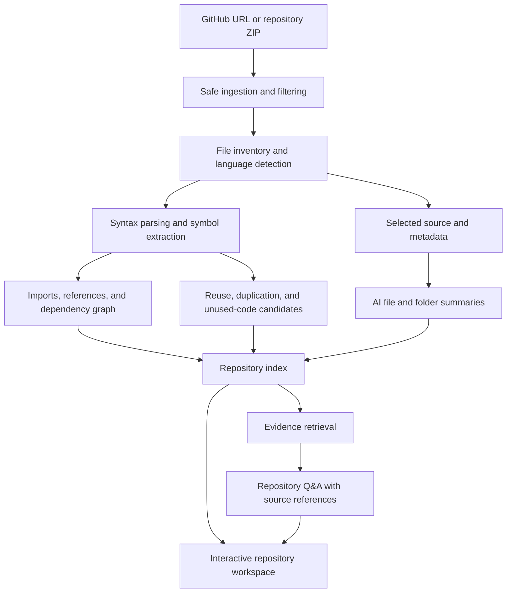

# Grepo

### See the structure. Understand the code. Find what matters.

**Grepo** is a developer onboarding and codebase exploration tool that turns a software repository into an understandable map of its files, folders, and code. Developers can browse a project, inspect basic metadata, and view structured Python analysis.

> **Project status: working foundation; advanced analysis is planned.** Grepo currently includes a React dashboard, safe ZIP upload and extraction, file inventory, and Python AST analysis. It does not include AI features or an IBM BOB integration.

## Technology stack

- Frontend: React 19, TypeScript 5.7, Vite 6
- Backend: Python 3.10+, FastAPI, Pydantic, Uvicorn
- Python analysis: standard-library `ast`
- API: REST with JSON and multipart ZIP upload
- Storage: temporary/project filesystem; no database

## Installation and running

Prerequisites are Python 3.10+ and Node.js 18+ with npm. Run backend and frontend in separate PowerShell terminals from the Grepo repository root.

Backend setup and launch:

```powershell
cd backend
python -m venv .venv
.\.venv\Scripts\Activate.ps1
python -m pip install -r requirements.txt
uvicorn app.main:app --reload --port 8000
```

Frontend setup and launch:

```powershell
cd frontend
npm install
npm run dev
```

Vite normally serves the UI at `http://localhost:5173`; the API is at `http://localhost:8000` and its interactive docs are at `/docs`. Set `VITE_API_BASE_URL` to change the API origin. Uploaded projects default to the system temporary directory under `grepo/projects`; set `GREPO_PROJECTS_DIR` to select another server-controlled location.

## API overview

All routes are prefixed with `/api`:

| Method | Route | Purpose |
| --- | --- | --- |
| `GET` | `/api/health` | Health status |
| `POST` | `/api/projects` | Upload a ZIP in multipart field `file` |
| `GET` | `/api/projects/{project_id}` | Project metadata and file inventory |
| `GET` | `/api/projects/{project_id}/files` | File inventory for the dashboard |
| `POST` | `/api/projects/{project_id}/analyze` | Structured Python AST analysis |

ZIP uploads are limited to 50 MiB, with a 25 MiB per-file extraction limit, 250 MiB total extracted data, and 10,000 entries. Unsafe paths, symlinks, special files, and unsupported compression are rejected. `.git`, `node_modules`, `__pycache__`, `.venv`, `dist`, and `build` directories are skipped. Uploaded source is never executed.

---

## The idea

The long-term vision is to connect a GitHub repository or upload an exported archive, then explain what each part does and how it relates. The current foundation accepts ZIP uploads; GitHub integration and advanced explanations remain future work.

The goal is to help developers answer three questions:

- **What is here?** Understand the project layout and the responsibilities of individual files and folders.
- **How does it work together?** Follow dependencies, shared utilities, and relationships between functions.
- **What should I look at next?** Find reusable code, investigate possible duplication, and review potentially unused functions.

## Planned features

| Feature | What it will do |
| --- | --- |
| **Project structure explorer** | Visualize the repository as an expandable file tree and a connected architecture view. Group files by folder, feature, or responsibility without changing the original repository. |
| **AI-generated file and folder summaries** | Explain the purpose of each supported source file and directory, including important functions, exports, and connections to surrounding code. Show unsupported or skipped files explicitly. |
| **Dependency visualization** | Show internal imports and module relationships, alongside external packages declared in supported manifests. Separate confirmed connections from relationships that could not be resolved. |
| **Reusable and shared-function discovery** | Highlight exported functions, shared utilities, and broadly referenced helpers. Show where they are defined and used, and suggest reuse opportunities without assuming they are safe to move. |
| **Potential duplicate detection** | Surface identical or structurally similar functions for comparison, with source locations and an explanation of the match. |
| **Potentially unused-function detection** | Flag functions for which no references were found within the analyzed scope. Treat findings as review candidates, not proof that code can be deleted. |
| **Ask questions about the repository** | Answer natural-language questions using relevant code and summaries, with file paths and line references where available. |

### Organizing a project does not mean silently rewriting it

The initial product will organize the **view of the repository**: searchable groups, tags, maps, and navigation. Moving files, changing imports, merging functions, or deleting code is outside the initial MVP. Any future refactoring workflow should require a preview and explicit approval.

## Example questions

- “What does this project do, and where should I start reading?”
- “Where is authentication implemented?”
- “Which files depend on this module?”
- “Is there already a helper for validating email addresses?”
- “What is the difference between these two similar functions?”
- “Why was this function flagged as potentially unused?”
- “Which parts of the project would be affected by changing this utility?”

Answers should distinguish facts found in the repository from inferences and report when the evidence is insufficient.

## Planned user journey

1. **Import a repository.** Start with a public GitHub URL or a ZIP archive. Add authorized private-repository access in a later phase.
2. **Choose the analysis scope.** Select a branch or revision where supported, review exclusions, and confirm which files may be sent to an AI provider.
3. **Build the project map.** Inventory files, identify supported languages, extract symbols, and resolve imports and references where possible.
4. **Explore the workspace.** Navigate folders, select files, read summaries, and inspect dependency relationships.
5. **Review findings.** Compare reuse opportunities, possible duplicates, and potentially unused functions against the source.
6. **Ask questions.** Retrieve relevant evidence and generate an answer linked to the analyzed repository snapshot.

## Long-term architecture vision



### Analysis approach

**Static analysis first.** Use language-aware parsing for supported languages to collect files, symbols, exports, imports, and references. Keep observed facts separate from AI-generated explanations.

**Contextual summaries.** Generate file summaries from source and extracted metadata, then produce folder summaries from the responsibilities of their contents. Record the analyzed commit or archive identifier so results can be tied to a specific snapshot.

**Evidence-backed findings.** Each reuse, duplication, or unused-code candidate should include its location, supporting evidence, scope, and limitations. Prefer “no references found in the analyzed files” over “safe to delete.”

**Grounded Q&A.** Retrieve relevant source passages and analysis results before generating an answer. Cite source locations, distinguish inference from observation, and acknowledge incomplete coverage.

**Provider-neutral AI layer.** Keep model access behind an adapter so the team can choose the provider and explore an IBM BOB-related workflow without implying an integration already exists.

## MVP scope

The working foundation supports local ZIP ingestion, file inventory, and basic Python AST analysis. JavaScript and TypeScript files appear in the inventory but are not parsed yet.

- [x] Upload a local ZIP with archive size, extracted size, and file-count limits.
- [x] Browse the project tree and basic file metadata in the dashboard.
- [x] Extract Python function, class, and import information with line ranges.
- [x] Show upload, loading, error, and empty states.
- [ ] Import a public GitHub repository.
- [ ] Add JavaScript and TypeScript analyzers.
- [ ] Generate source-grounded summaries for files and folders.
- [ ] Display internal and external dependency relationships.
- [ ] Highlight reusable functions and their references.
- [ ] Surface exact or structural duplicate candidates.
- [ ] Flag potentially unused functions with explicit scope and limitations.
- [ ] Answer repository questions with source references.

### Suggested demo

Import a small sample repository containing a shared utility, two similar functions, and a function with no obvious references. Show the structure, open a file summary, follow a dependency, compare the flagged functions, and ask where a specific behavior is implemented.

## Future directions

Potential extensions include private-repository authorization, more programming languages, commit-to-commit analysis, incremental re-indexing, shareable reports, team annotations, and explicitly approved refactoring suggestions.

## Project structure

```text
grepo/
├── backend/
│   ├── app/api/              # FastAPI routes
│   ├── app/analyzers/        # Language-neutral analyzer contract and Python AST parser
│   ├── app/features/         # Independent future-feature contracts
│   ├── app/models/           # Shared Pydantic codebase models
│   ├── app/services/         # Archive, storage, inventory, and analysis services
│   └── tests/                # API, upload, model, and analyzer tests
├── frontend/src/
│   ├── components/           # Upload, project tree, and status UI
│   ├── pages/                # Dashboard
│   ├── services/             # Centralized REST client
│   └── types/                # TypeScript API and codebase contracts
├── docs/architecture.md
├── bob_sessions/             # Local session artifacts
├── README.md
└── .gitignore
```

## Safety and privacy requirements

The current upload path enforces archive size and entry limits, rejects traversal paths and links, filters selected generated/dependency directories, and never executes uploaded code. The following are additional privacy requirements for future work, not claims that those protections exist:

- Analyze repositories as data; do not execute uploaded code, install its dependencies, or run its scripts during ingestion.
- Enforce archive size, extracted size, path, symlink, and file-count checks before processing uploads.
- Add secret scanning and exclusion for environment files and private keys before supporting private repositories. Current directory filtering is only a precaution, not a guarantee that uploads contain no secrets.
- Make AI-provider data sharing explicit. Send only the selected, necessary source content and keep authorization tokens out of prompts and logs.
- Treat instructions inside source files and documentation as untrusted repository content, not commands for the analysis system.
- Limit analysis and findings to the selected repository snapshot. State when dynamic behavior, generated code, external callers, or unsupported syntax could affect conclusions.
- Provide deletion controls and a documented retention policy before accepting private code.
- Never automatically delete or merge functions based on a generated finding.

## How we will evaluate the MVP

Use small, inspectable fixtures with known expected results. The current suite covers upload safety, project inventory, shared models, and Python AST results. As summaries and findings are added, include counterexamples such as exported library functions, callbacks, dynamically selected handlers, and intentional duplicates.

Track correctness and false positives separately. Validate that answers actually support their cited sources and that unsupported questions produce an honest limitation rather than a confident guess.

## Getting started

The app can be run locally using the commands in [Installation and running](#installation-and-running). Backend tests can be run from the repository root with `backend/.venv/Scripts/python.exe -m pytest backend/tests -q` after installing `backend/requirements-dev.txt`.

## Contributing

Keep routes thin, place backend behavior in the relevant service or `backend/app/features/<feature>/` package, and route all frontend requests through `frontend/src/services/api.ts`. Mirror public response shapes in the frontend types and add focused tests. For proposed analysis findings, include an example where the finding should **not** appear.

## License

A project license has not been selected yet.

---

**Grepo — understand the repository before you change it.**
