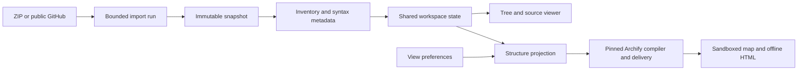
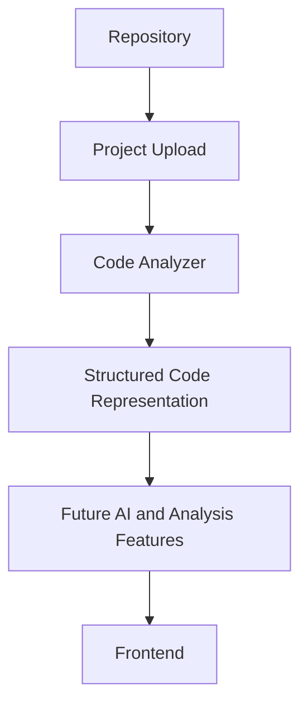

# GREPO architecture

## Structure workspace (v1)

The current React shell uses `/api/v1` and a local browser workspace cookie.
ZIP uploads and commit-pinned public GitHub downloads enter the same bounded
job pipeline. Archive extraction, immutable source storage, inventory and
Python syntax extraction complete before a snapshot is published. Each
canonical entity ID includes its snapshot, kind and path. The source reader
checks ownership, expiry, file hashes and requested byte/line limits.

`run_service` handles admission, cancellation and publication. `snapshot_service`
owns copied source and metadata, `inventory_service` defines file capabilities,
and `retention_service` purges expired bytes. The Python subprocess parses data;
it does not import repository modules. Run one API worker because admission and
publication locks are process-local.

`graph_service` produces observed containment only. `view_service` adds view-only
labels/groups and compiles small chapters through the complete pinned Archify
package. Deterministic delivery receipts are distinct from browser evidence.
GREPO wraps the output with provenance, license notices, CSP and a checked
selection bridge; the upstream package is unchanged. Source bytes are excluded
from exports.

On the frontend, `WorkspaceContext` owns revision, selection, capabilities and
preferences. Shared adapters handle sessions, requests and error envelopes.
Future feature modules register typed components and abortable loaders at
actual page slots. Missing slots render “Not connected” without feature calls.
The corresponding backend stubs return HTTP 501. See
[the integration guide](../INTEGRATION_GUIDE.md) for the concrete interfaces.

## Preserved legacy foundation

The following describes the starter `/api/projects` lifecycle, still available
for compatibility. The v1 UI uses the structure workspace above.

## Data Flow

The original UI could also render the uploaded file inventory before analysis is requested. Python AST analysis is available now; AI and advanced analysis steps remain future work.

## Boundaries

The React application in `frontend/` communicates with the FastAPI service in `backend/` over REST endpoints. Frontend components do not import backend code; the TypeScript interfaces in `frontend/src/types/codebase.ts` mirror the canonical Pydantic models in `backend/app/models/codebase.py`.

The backend separates HTTP routing (`app/api/`), response models (`app/models/`), orchestration (`app/services/`), and language-specific parsing (`app/analyzers/`). API handlers should remain thin and delegate analysis work to services. ZIP safety and extraction live in `app/services/project_archive.py`; project metadata and file inventory live in `app/services/project_storage.py`; Python project traversal lives in `app/services/project_analysis.py`.

## Analyzer extension point

`SourceAnalyzer` defines a language-neutral contract. `AnalyzerService` selects an implementation from the file extension, allowing new language analyzers to be added without changing API routing. The initial `PythonAnalyzer` uses Python's standard-library `ast` module to report functions, classes, imports, and source line ranges.

Analyzer results use the shared `File`, `Function`, and `Class` models. `Project` and `Relationship` are available for later project and graph features. Results remain structured data, not generated explanations.

## Future feature boundaries

`backend/app/features/` contains independent contract packages for `summaries`, `relationships`, `reusable_functions`, `duplicate_detection`, `codebase_chat`, and `onboarding`. Each package defines placeholder Pydantic request/result types and a typed service Protocol based on the shared async `FeatureService` interface. These contracts intentionally have no feature fields or implementations yet and are not mounted as API routes.

## Legacy API

- `GET /api/health`: returns `{"status":"ok"}` for local development and frontend connectivity checks.
- `POST /api/projects`: accepts a multipart `file` ZIP upload, validates it, filters generated/dependency directories, and stores extracted files under the server-controlled project root. Successful uploads return a project ID, project name, and extracted file count.
- `GET /api/projects/{project_id}` and `GET /api/projects/{project_id}/files`: return project metadata and a file inventory used by the dashboard tree. A small JSON sidecar stores the uploaded archive name; no database is used.
- `POST /api/projects/{project_id}/analyze`: parses stored `.py` files and returns structured file results containing the relative path, language, function/class line ranges, and imported modules. Syntax errors are reported as HTTP 422.

Uploads are capped at 50 MiB compressed, 25 MiB per extracted file, 250 MiB total extracted data, 200,000 raw archive entries, and 50,000 retained files after ignored directories. Extraction rejects absolute/traversal paths, special files, encrypted entries, unsupported compression, and path collisions. v1 imports safely skip symbolic links with a diagnostic; the legacy API rejects them. ZIP members are copied as data only; uploaded code is never executed. The storage root defaults to a `codecanopy/projects` directory under the operating system temporary directory and can be set with `CODECANOPY_PROJECTS_DIR`.

## Not in the legacy lifecycle

Repository checkout, database-backed project history, authentication, AI provider integration, dependency graphs, duplicate detection, and unused-function detection are intentionally deferred. Repository contents must be treated as data and must never be executed by the service.
